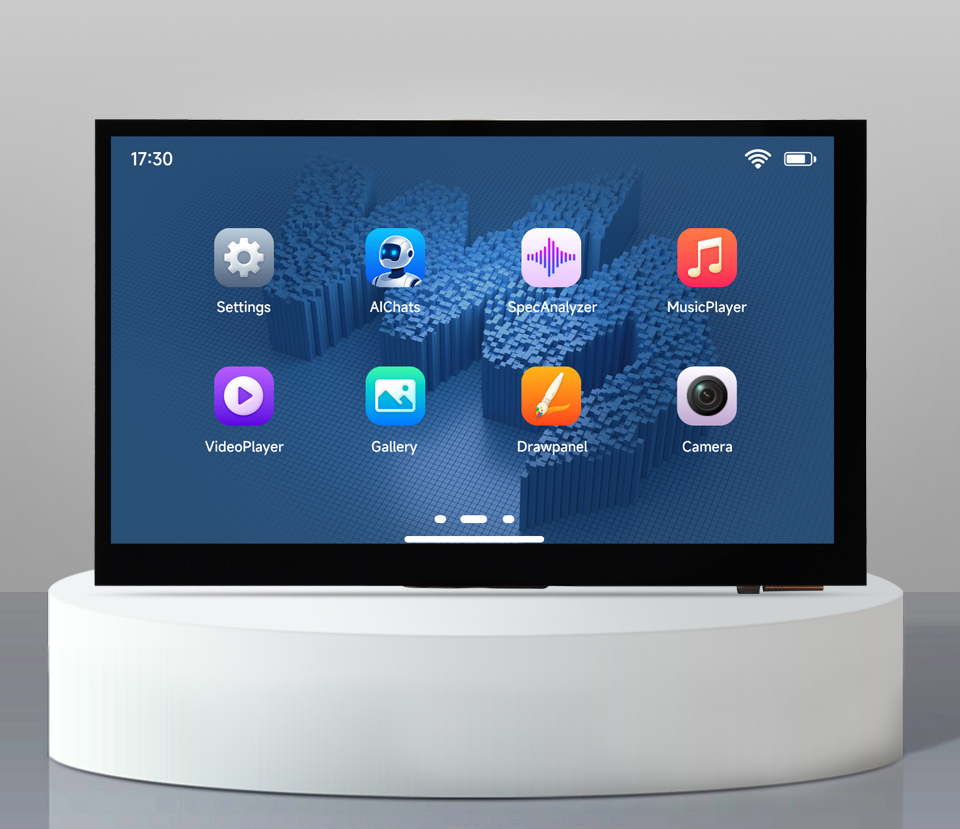

<div align="center">
  <h1>ESP32-P4-WIFI6-Touch-LCD-7B</h1>
  <p><strong>7-inch 1024 × 600 touch display development board powered by ESP32-P4 and ESP32-C6</strong></p>
  <p>
    <a href="https://github.com/waveshareteam/ESP32-P4-WIFI6-Touch-LCD-7B/actions/workflows/esp-idf-examples.yml"></a>
    <a href="LICENSE"></a>
  </p>
  <p>
    <a href="README_ZH.md">中文</a> ·
    <a href="https://www.waveshare.com/esp32-p4-wifi6-touch-lcd-7b.htm">🌐 Product Page</a> ·
    <a href="https://docs.waveshare.com/ESP32-P4-WIFI6-Touch-LCD-7B">📚 Documentation</a> ·
    <a href="examples/esp-idf/">🧩 ESP-IDF Examples</a> ·
    <a href="examples/arduino/">🔧 Arduino Examples</a> ·
    <a href="firmware/">📦 Firmware</a>
  </p>
  
</div>

---

## ✨ Overview

This repository provides first-party ESP-IDF and Arduino examples, GitHub
Actions validation, ESP-Brookesia firmware source, and a prebuilt factory
firmware image for the Waveshare ESP32-P4-WIFI6-Touch-LCD-7B.

The board combines the multimedia capabilities of ESP32-P4 with an ESP32-C6
wireless coprocessor, a 7-inch capacitive touch display, camera and audio
interfaces, USB, microSD, and industrial expansion interfaces. See the
[product page](https://www.waveshare.com/esp32-p4-wifi6-touch-lcd-7b.htm)
for ordering information and the
[official documentation](https://docs.waveshare.com/ESP32-P4-WIFI6-Touch-LCD-7B)
for complete hardware and setup guidance.

## 🖥️ Hardware Overview

| Feature | Device / interface |
| --- | --- |
| Main processor | ESP32-P4NRW32 with dual-core HP RISC-V processing up to 360 MHz and a low-power core |
| Memory | 32 MB in-package PSRAM and 32 MB external NOR Flash |
| Wireless | ESP32-C6-MINI-1 over SDIO, providing 2.4 GHz Wi-Fi 6 and Bluetooth 5 (LE) |
| Display | 7-inch 1024 × 600 IPS touch display over MIPI-DSI |
| Touch | GT911 capacitive controller with five-point touch |
| Camera | MIPI-CSI (2-lane) connector; an OV5647 camera is available with the camera version |
| Audio | ES8311 codec, ES7210 audio ADC, dual microphones, and speaker header |
| Storage and expansion | microSD, USB 2.0 OTG HS, CAN/TWAI, RS485, I2C, UART, and GPIO |
| Board support | Managed component: `waveshare/esp32_p4_wifi6_touch_lcd_7b` 3.0.0 |
| ESP-IDF target | `esp32p4` |

> [!NOTE]
> Hardware pin assignments are maintained in the official product
> documentation and board support package. This repository does not currently
> include a local schematic copy.

## 🚀 Quick Start

Install ESP-IDF `v5.5.5`, then build the first-run board check:

```bash
cd examples/esp-idf/00_board_check
idf.py set-target esp32p4
idf.py build
idf.py -p PORT flash monitor
```

Replace `PORT` with the board's serial port. After the board check succeeds,
continue with the [Getting Started guide](docs/GETTING_STARTED.md) or choose an
example from the table below.

## 🧪 ESP-IDF Examples

| Example | Focus |
| --- | --- |
| [00_board_check](examples/esp-idf/00_board_check/) | First-run board, memory, and chip-revision checks |
| [01_how_to_create_project](examples/esp-idf/01_how_to_create_project/) | Minimal project template |
| [02_hello_world](examples/esp-idf/02_hello_world/) | Basic application and logging |
| [03_i2c_tools](examples/esp-idf/03_i2c_tools/) | I2C scanning and diagnostics |
| [04_sdmmc](examples/esp-idf/04_sdmmc/) | microSD card access |
| [05_wifistation](examples/esp-idf/05_wifistation/) | Wi-Fi station through the ESP32-C6 hosted path |
| [06_i2s_codec](examples/esp-idf/06_i2s_codec/) | Board audio input and output |
| [07_color_panel](examples/esp-idf/07_color_panel/) | MIPI-DSI color-bar bring-up |
| [08_lvgl_display_panel](examples/esp-idf/08_lvgl_display_panel/) | LVGL display and GT911 touch integration |
| [09_lvgl_demo_v9](examples/esp-idf/09_lvgl_demo_v9/) | LVGL 9 demo |
| [11_esp_brookesia_phone](examples/esp-idf/11_esp_brookesia_phone/) | ESP-Brookesia application UI |
| [12_usb_extend_screen](examples/esp-idf/12_usb_extend_screen/) | USB extended display |
| [13_rs485_test](examples/esp-idf/13_rs485_test/) | RS485 transmit and receive |
| [14_twai_transmit](examples/esp-idf/14_twai_transmit/) | CAN/TWAI transmit |
| [15_nvs_counter](examples/esp-idf/15_nvs_counter/) | Persistent NVS counter |
| [16_freertos_tasks](examples/esp-idf/16_freertos_tasks/) | FreeRTOS tasks and queues |
| [17_system_monitor](examples/esp-idf/17_system_monitor/) | Serial system diagnostics |
| [18_mp4_player](examples/esp-idf/18_mp4_player/) | MP4 or AVI playback from microSD |

See the [complete example index](examples/README.md) for recommended learning
order and hardware requirements.

## 🧪 Arduino Examples

The [`examples/arduino/`](examples/arduino/) directory provides 12 Arduino-ESP32
3.3.11 sketches for the 7B display, GT911 touch, ESP32-C6 Wi-Fi path, camera,
microSD, audio, RS485, and CAN/TWAI. Select `ESP32P4 Dev Module`, enable PSRAM,
and choose the Chip Variant that matches the ESP32-P4 silicon revision. See the
[Arduino example guide](examples/arduino/README.md) for menu settings, pin maps,
and field-bus wiring requirements.

## 📡 ESP32-P4 and ESP32-C6 Wireless

ESP32-P4 does not contain an integrated radio. Wi-Fi and Bluetooth are provided
by the ESP32-C6 coprocessor over SDIO using ESP-Hosted. Keep the ESP32-C6 slave
firmware compatible with the `esp_hosted` and `esp_wifi_remote` versions
declared by each wireless project before changing or reflashing the
coprocessor.

## ✅ Continuous Integration

The [ESP-IDF examples workflow](https://github.com/waveshareteam/ESP32-P4-WIFI6-Touch-LCD-7B/actions/workflows/esp-idf-examples.yml)
discovers first-party projects and builds them for `esp32p4`:

| ESP-IDF version | Current coverage |
| --- | --- |
| `v5.5.5` | All 19 first-party examples |
| `v6.0.2` | All 19 first-party examples |

The [Arduino examples workflow](https://github.com/waveshareteam/ESP32-P4-WIFI6-Touch-LCD-7B/actions/workflows/arduino-examples.yml)
compiles all 12 Arduino sketches with Arduino-ESP32 3.3.11 and the `prev3`
Chip Variant. It is compile coverage only and does not publish firmware ZIPs.

The lightweight discovery job classifies the complete pull-request diff before
starting expensive builds. Documentation-only and governance-only changes run
the repository checks without building examples; direct source changes select
the affected example, and shared CI or configuration changes select all 19.
All 48 example builds default to the pre-v3 `rev1_3` silicon profile without
multiplying the matrix. `firmware/brookesia` remains outside that matrix but has
an explicitly maintained two-profile workflow (`rev1_3` and `rev3_x`). See
[Continuous Integration](docs/CI.md) for routing and dispatch options. CI is
compile evidence only, not hardware/HIL validation; no local schematic is held
in this repository and the online BSP/application glue boundary remains in use.

## 📦 Firmware

The [`firmware/`](firmware/) directory keeps two different firmware surfaces:

- [`firmware/brookesia/`](firmware/brookesia/) is an inventoried delivery-source
  project; it is not built by the default example CI.
- `firmware/ESP32-P4-WIFI6-Touch-LCD-7B-FactoryOnly.bin` is the existing
  prebuilt factory firmware image and is not a CI build output.

Factory BIN files are immutable delivery artifacts. Firmware-source changes
and validation require an explicitly scoped firmware-maintenance workflow. See
[Firmware](firmware/README.md) for delivery and flashing boundaries.

## 🗂️ Repository Layout

| Path | Purpose |
| --- | --- |
| [`examples/esp-idf/`](examples/esp-idf/) | First-party ESP-IDF projects |
| [`examples/arduino/`](examples/arduino/) | Arduino sketches and bundled board libraries |
| [`firmware/`](firmware/) | Brookesia source and prebuilt factory firmware |
| [`config/`](config/) | Shared ESP32-P4 revision overlays |
| [`docs/`](docs/) | Getting-started, CI, structure, and revision notes |
| [`assets/`](assets/) | Product images used by repository documentation |
| [`.github/`](.github/) | CI workflows and repository checks |

Use lowercase `examples/esp-idf/` and `examples/arduino/` paths. Generated
build outputs such as `build/`, `managed_components/`, `dependencies.lock`, and
local `sdkconfig` files are intentionally ignored.

## 📚 Documentation

- [Official Product Documentation](https://docs.waveshare.com/ESP32-P4-WIFI6-Touch-LCD-7B)
- [Getting Started](docs/GETTING_STARTED.md)
- [Examples](examples/README.md)
- [Arduino Examples](examples/arduino/README.md)
- [Example Guide](docs/EXAMPLES_GUIDE.md)
- [Firmware](firmware/README.md)
- [Continuous Integration](docs/CI.md)
- [Project Structure](docs/PROJECT_STRUCTURE.md)
- [ESP32-P4 Revision Configuration](docs/ESP32P4_REVISION_CONFIG.md)

## 🤝 Support and Contributions

Contributions and reproducible issue reports are welcome. Include the board
version, example path, ESP-IDF version, reproduction steps, expected behavior,
actual behavior, and relevant serial logs.

- [Contribution Guide](CONTRIBUTING.md)
- [Support Guide](SUPPORT.md)
- [Open an Issue](https://github.com/waveshareteam/ESP32-P4-WIFI6-Touch-LCD-7B/issues/new)
- [Technical Support](https://docs.waveshare.com/ESP32-P4-WIFI6-Touch-LCD-7B/Technical-Support/)

## 📄 License

This repository is licensed under the Apache License 2.0. See
[LICENSE](LICENSE).
