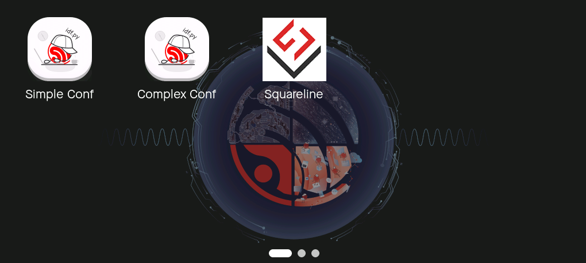

# Brookesia-Core (Preview)

* [English Version](./README.md)

## 概述

> [!WARNING]
> Brookesia-Core 当前处于开发实验阶段，各项功能接口可能会发生变更。

Brookesia-Core 是 ESP-Brookesia 的核心组件，提供了基础的系统功能，主要特性包括：

- 提供丰富的标准化系统 UI，支持动态调整 UI 样式。
- 采用 app 的应用管理方式，实现多个 app 的 UI 隔离与共存，使用户专注于各自 app 内的 UI 实现。
- 应用 UI 兼容 "[Squareline](https://squareline.io/) 导出代码" 的开发方式。

Phone 系统 UI 的功能演示如下：

    

## 内置系统

当前，Brookesia-Core 内置了以下系统：

- [Phone](./docs/system_ui_phone_CN.md)
- Speaker

## 如何使用

请参阅文档 - [如何使用](./docs/how_to_use_CN.md) 。
